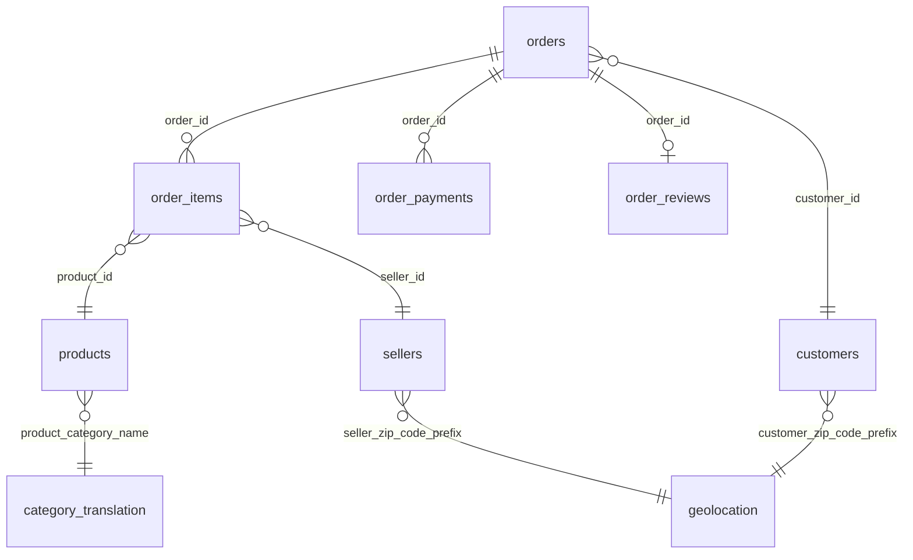

# 📊 Power BI Dashboard — Setup & Build Guide

> **E-Commerce Sales Performance Dashboard**
> _Brazilian E-Commerce (Olist) Dataset · PostgreSQL → Power BI_

---

## Table of Contents

1. [Data Connection](#1--data-connection)
2. [Data Model & DAX Measures](#2--data-model--dax-measures)
3. [Dashboard Pages (5 Pages)](#3--dashboard-pages)
4. [Formatting & Theming](#4--formatting--theming)
5. [Publishing & Scheduled Refresh](#5--publishing--scheduled-refresh)

---

## 1 · Data Connection

### 1.1 Prerequisites

| Requirement | Details |
|---|---|
| **Power BI Desktop** | Latest version ([Download](https://powerbi.microsoft.com/desktop/)) |
| **PostgreSQL Server** | Running locally or on a remote host |
| **Npgsql Driver** | Required for Power BI ↔ PostgreSQL connectivity |

### 1.2 Install the Npgsql Driver

Power BI Desktop does not ship with a PostgreSQL connector driver by default. You must install **Npgsql** manually.

1. Download the latest **Npgsql** installer from the [official GitHub releases page](https://github.com/npgsql/npgsql/releases).
   - Choose the `.msi` Windows Installer package (e.g., `Npgsql-<version>.msi`).
2. Run the installer and follow the on-screen prompts.
3. **Restart Power BI Desktop** after installation.

> [!IMPORTANT]
> Make sure you download the **non-GAC** version of Npgsql that matches your Power BI Desktop bitness (typically 64-bit). If you encounter connection errors, verify that the Npgsql DLL is registered in the GAC by running `gacutil /l Npgsql` in a Developer Command Prompt.

### 1.3 Connect Power BI to PostgreSQL

1. Open **Power BI Desktop**.
2. Click **Home → Get Data → Database → PostgreSQL database**.
3. Enter the connection settings:

| Setting | Value |
|---|---|
| **Server** | `localhost` (or your remote host IP) |
| **Port** | `5432` (default PostgreSQL port) |
| **Database** | `ecommerce_olist` |
| **Schema** | `public` |

4. Choose **Database** authentication and enter your PostgreSQL username and password.
5. Click **OK** to connect.

### 1.4 Import vs DirectQuery

| Mode | Pros | Cons | Recommendation |
|---|---|---|---|
| **Import** | Fast dashboard rendering; data cached locally; full DAX support | Data is a snapshot; needs manual/scheduled refresh | ✅ **Recommended** |
| **DirectQuery** | Always live data; no local cache | Slower visuals; limited DAX; requires always-on DB | ❌ Overkill for this dataset |

> [!TIP]
> The Olist dataset contains ~100K orders and is relatively small (~130 MB total). **Import mode** will load everything into memory in seconds and give you the best interactive experience.

### 1.5 Views to Import

In the **Navigator** window, select the following SQL views (created by the project's SQL scripts):

| # | View Name | Description |
|---|---|---|
| 1 | `v_sales_summary` | Denormalized fact table — orders, items, payments, reviews, delivery |
| 2 | `v_monthly_sales` | Monthly aggregated revenue, orders, and AOV |
| 3 | `v_category_performance` | Revenue, orders, and avg review by product category |
| 4 | `v_customer_segments` | RFM-based customer segmentation |
| 5 | `v_seller_performance` | Seller-level KPIs (revenue, orders, rating, delivery) |
| 6 | `v_regional_sales` | State-level aggregated sales metrics |
| 7 | `v_payment_analysis` | Payment method and installment breakdowns |

Click **Load** (not Transform Data) to import all selected views.

---

## 2 · Data Model & DAX Measures

### 2.1 Relationships (If Importing Raw Tables)

If you choose to import the raw tables instead of pre-built views, set up the following relationships in the **Model** view:



| From Table | From Column | To Table | To Column | Cardinality | Cross-Filter |
|---|---|---|---|---|---|
| `orders` | `order_id` | `order_items` | `order_id` | 1 : Many | Single |
| `orders` | `order_id` | `order_payments` | `order_id` | 1 : Many | Single |
| `orders` | `order_id` | `order_reviews` | `order_id` | 1 : 1 | Single |
| `orders` | `customer_id` | `customers` | `customer_id` | Many : 1 | Single |
| `order_items` | `product_id` | `products` | `product_id` | Many : 1 | Single |
| `order_items` | `seller_id` | `sellers` | `seller_id` | Many : 1 | Single |

> [!NOTE]
> When using the pre-built **views**, relationships are unnecessary since each view is already a self-contained, denormalized dataset.

### 2.2 Recommended DAX Measures

Create a dedicated **Measures Table** (Home → Enter Data → name it `_Measures`) and add the following:

#### Core KPIs

```dax
Total Revenue =
SUM ( v_sales_summary[price] )
```

```dax
Total Orders =
DISTINCTCOUNT ( v_sales_summary[order_id] )
```

```dax
AOV (Avg Order Value) =
DIVIDE ( [Total Revenue], [Total Orders], 0 )
```

```dax
Avg Review Score =
AVERAGE ( v_sales_summary[review_score] )
```

#### Delivery Metrics

```dax
On-Time Delivery % =
DIVIDE (
    COUNTROWS (
        FILTER (
            v_sales_summary,
            v_sales_summary[order_delivered_customer_date]
                <= v_sales_summary[order_estimated_delivery_date]
        )
    ),
    COUNTROWS ( v_sales_summary ),
    0
) * 100
```

```dax
Avg Delivery Days =
AVERAGE ( v_sales_summary[delivery_days] )
```

#### Growth & Trends

```dax
MoM Revenue Growth % =
VAR CurrentMonthRevenue = [Total Revenue]
VAR PreviousMonthRevenue =
    CALCULATE (
        [Total Revenue],
        DATEADD ( v_sales_summary[order_purchase_timestamp], -1, MONTH )
    )
RETURN
    DIVIDE (
        CurrentMonthRevenue - PreviousMonthRevenue,
        PreviousMonthRevenue,
        0
    ) * 100
```

```dax
YTD Revenue =
TOTALYTD (
    [Total Revenue],
    v_sales_summary[order_purchase_timestamp]
)
```

#### Customer Metrics

```dax
Total Customers =
DISTINCTCOUNT ( v_sales_summary[customer_unique_id] )
```

```dax
Repeat Customer Rate % =
VAR TotalCustomers = [Total Customers]
VAR RepeatCustomers =
    COUNTROWS (
        FILTER (
            SUMMARIZE (
                v_sales_summary,
                v_sales_summary[customer_unique_id],
                "OrderCount", DISTINCTCOUNT ( v_sales_summary[order_id] )
            ),
            [OrderCount] > 1
        )
    )
RETURN
    DIVIDE ( RepeatCustomers, TotalCustomers, 0 ) * 100
```

### 2.3 Calculated Columns (Optional)

Add these to `v_sales_summary` if not already present in the view:

```dax
Delivery Days =
DATEDIFF (
    v_sales_summary[order_purchase_timestamp],
    v_sales_summary[order_delivered_customer_date],
    DAY
)
```

```dax
Order Month =
FORMAT ( v_sales_summary[order_purchase_timestamp], "YYYY-MM" )
```

```dax
Day of Week =
FORMAT ( v_sales_summary[order_purchase_timestamp], "dddd" )
```

---

## 3 · Dashboard Pages

### Page 1: Executive Overview

> _A high-level snapshot of business health for stakeholders._

#### Layout

```
┌─────────────────────────────────────────────────────────┐
│  [KPI]  [KPI]  [KPI]  [KPI]  [KPI]                     │
│  Revenue Orders  AOV  Review  On-Time                   │
├─────────────────────────────────┬───────────────────────┤
│                                 │                       │
│  📈 Line Chart                  │  📊 Bar Chart         │
│  Monthly Revenue Trend          │  MoM Growth Rate      │
│                                 │                       │
├─────────────────────────────────┴───────────────────────┤
│  🔽 Slicer: Date Range (Between)                        │
└─────────────────────────────────────────────────────────┘
```

#### Visual Details

| # | Visual Type | Data Source | Fields | Format Notes |
|---|---|---|---|---|
| 1 | **KPI Card** | `_Measures` | `[Total Revenue]` | Format as currency (R$), 0 decimals |
| 2 | **KPI Card** | `_Measures` | `[Total Orders]` | Format with thousands separator |
| 3 | **KPI Card** | `_Measures` | `[AOV]` | Format as currency (R$), 2 decimals |
| 4 | **KPI Card** | `_Measures` | `[Avg Review Score]` | Show 1 decimal, add ⭐ in title |
| 5 | **KPI Card** | `_Measures` | `[On-Time Delivery %]` | Suffix with `%` |
| 6 | **Line Chart** | `v_monthly_sales` | X-axis: `month` · Y-axis: `total_revenue` | Show data labels, smooth line |
| 7 | **Bar Chart** | `_Measures` | X-axis: `Order Month` · Y-axis: `[MoM Revenue Growth %]` | Conditional colors: green ≥ 0, red < 0 |
| 8 | **Slicer** | `v_sales_summary` | `order_purchase_timestamp` | Style: **Between** date range picker |

---

### Page 2: Sales Trends

> _Deep dive into temporal sales patterns and seasonality._

#### Layout

```
┌──────────────────────────────────┬─────────────────────┐
│  📊 Combo Chart                  │  📊 Area Chart       │
│  Monthly Revenue & Orders        │  Quarterly Revenue   │
├──────────────────────────────────┼─────────────────────┤
│  📊 Matrix (Heatmap)             │  📊 Bar Chart        │
│  Year × Month Revenue            │  Revenue by Day of   │
│                                  │  Week                │
├──────────────────────────────────┴─────────────────────┤
│  🔽 Slicer: Year    🔽 Slicer: Quarter                  │
└────────────────────────────────────────────────────────┘
```

#### Visual Details

| # | Visual Type | Fields | Configuration |
|---|---|---|---|
| 1 | **Combo Chart** (Bar + Line) | X-axis: `month` · Column Y: `total_revenue` · Line Y: `order_count` | Use secondary Y-axis for order count |
| 2 | **Area Chart** | X-axis: Quarter (Year-Q#) · Y-axis: `total_revenue` | Gradient fill; stacked if multi-year |
| 3 | **Matrix** (Heatmap) | Rows: Year · Columns: Month (1–12) · Values: `[Total Revenue]` | Enable **conditional formatting → Background color scale** (light-to-dark gradient) |
| 4 | **Clustered Bar Chart** | X-axis: `[Day of Week]` · Y-axis: `[Total Revenue]` | Sort by custom day order (Mon→Sun) |
| 5 | **Slicer** | Year extracted from `order_purchase_timestamp` | Dropdown style |
| 6 | **Slicer** | Quarter extracted from `order_purchase_timestamp` | Tile/Button style |

> [!TIP]
> For the Matrix heatmap, go to **Format → Cell elements → Background color → Advanced controls** and set the color scale from white (min) to your primary brand color (max). This instantly highlights peak months.

---

### Page 3: Regional Analysis

> _Geographic distribution of sales across Brazilian states._

#### Layout

```
┌──────────────────────────────────┬─────────────────────┐
│                                  │  📊 Bar Chart        │
│  🗺️ Filled Map                   │  Top 10 States by    │
│  Revenue by State                │  Revenue             │
│                                  │                      │
├──────────────────────────────────┴─────────────────────┤
│  📋 Table: State Details                                │
│  State | Revenue | Orders | AOV | Avg Review Score      │
├────────────────────────────────────────────────────────┤
│  🔽 Slicer: State                                       │
└────────────────────────────────────────────────────────┘
```

#### Visual Details

| # | Visual Type | Fields | Configuration |
|---|---|---|---|
| 1 | **Filled Map** | Location: `customer_state` · Color saturation: `[Total Revenue]` | Set map to Brazil; use gradient blue/purple fill |
| 2 | **Clustered Bar Chart** | Y-axis: `customer_state` (Top N = 10) · X-axis: `[Total Revenue]` | Use Top N filter = 10 by `[Total Revenue]` |
| 3 | **Table** | Columns: `customer_state`, `[Total Revenue]`, `[Total Orders]`, `[AOV]`, `[Avg Review Score]` | Enable conditional formatting on Revenue column (data bars) |
| 4 | **Slicer** | `customer_state` from `v_regional_sales` | Dropdown with search enabled |

> [!NOTE]
> For the Filled Map, Power BI recognizes Brazilian state abbreviations (SP, RJ, MG, etc.) when you set the **Location** field's data category to **State or Province** in the Modeling tab.

---

### Page 4: Product Performance

> _Category-level insights to identify top performers and underperformers._

#### Layout

```
┌──────────────────────────────────┬─────────────────────┐
│  🟩 Treemap                      │  📊 Horiz. Bar Chart │
│  Revenue by Category             │  Top 10 Categories   │
│                                  │  by Revenue          │
├──────────────────────────────────┼─────────────────────┤
│  📊 Scatter Plot                  │  📋 Table            │
│  Revenue vs Avg Review Score     │  Category Details    │
│                                  │                      │
├──────────────────────────────────┴─────────────────────┤
│  🔽 Slicer: Product Category                            │
└────────────────────────────────────────────────────────┘
```

#### Visual Details

| # | Visual Type | Fields | Configuration |
|---|---|---|---|
| 1 | **Treemap** | Group: `product_category_name_english` · Values: `[Total Revenue]` | Color by revenue; show category labels |
| 2 | **Horizontal Bar Chart** | Y-axis: `product_category_name_english` (Top N = 10) · X-axis: `[Total Revenue]` | Sort descending; data labels on |
| 3 | **Scatter Plot** | X-axis: `[Total Revenue]` · Y-axis: `[Avg Review Score]` · Details: `product_category_name_english` · Size: `[Total Orders]` | Add a constant line at Avg Review = 4.0 for reference |
| 4 | **Table** | Columns: `product_category_name_english`, `[Total Revenue]`, `[Total Orders]`, `[AOV]`, `[Avg Review Score]` | Sort by Revenue desc; data bars on Revenue |
| 5 | **Slicer** | `product_category_name_english` | Dropdown with search; multi-select enabled |

> [!TIP]
> The scatter plot is particularly powerful — categories in the **top-right quadrant** (high revenue + high review score) are your star products. Categories in the bottom-right (high revenue + low reviews) need quality attention.

---

### Page 5: Customer & Payments

> _Customer segmentation and payment behavior analysis._

#### Layout

```
┌──────────────────────────────────┬─────────────────────┐
│  🍩 Donut Chart                  │  📊 Stacked Bar      │
│  Payment Method Distribution     │  Installments        │
│  (by value)                      │  Distribution        │
├──────────────────────────────────┼─────────────────────┤
│  📊 Bar Chart                    │  📊 Histogram         │
│  Customer RFM Segments           │  Delivery Time       │
│                                  │  Distribution        │
├──────────────────────────────────┴─────────────────────┤
│  [KPI Card] Repeat Customer Rate                        │
└────────────────────────────────────────────────────────┘
```

#### Visual Details

| # | Visual Type | Fields | Configuration |
|---|---|---|---|
| 1 | **Donut Chart** | Legend: `payment_type` · Values: `payment_value` (Sum) | Show % labels; explode largest slice |
| 2 | **Stacked Bar Chart** | X-axis: `payment_installments` (grouped into bins: 1, 2–3, 4–6, 7–12, 13+) · Y-axis: Count of orders | Color by payment type |
| 3 | **Clustered Bar Chart** | X-axis: `rfm_segment` from `v_customer_segments` · Y-axis: Count of customers | Sort by count desc; conditional colors by segment |
| 4 | **Histogram** | Values: `[Delivery Days]` · Bins: auto or 5-day intervals | Use a single color; show mean line |
| 5 | **KPI Card** | `[Repeat Customer Rate %]` | Large font; subtitle "% of customers with 2+ orders" |

> [!NOTE]
> For the installments distribution, create a calculated column to bin the installment counts:
> ```dax
> Installment Group =
> SWITCH (
>     TRUE (),
>     v_payment_analysis[payment_installments] = 1, "1 (Full)",
>     v_payment_analysis[payment_installments] <= 3, "2–3",
>     v_payment_analysis[payment_installments] <= 6, "4–6",
>     v_payment_analysis[payment_installments] <= 12, "7–12",
>     "13+"
> )
> ```

---

## 4 · Formatting & Theming

### 4.1 Theme — Dark Gradient

Apply a consistent **dark theme** for a professional analytics look. Go to **View → Themes → Customize current theme** or import the JSON below.

### 4.2 Color Palette

| Role | Hex Code | Preview | Usage |
|---|---|---|---|
| **Primary** | `#667EEA` | 🟦 | KPI cards, primary bars, line charts |
| **Accent 1** | `#764BA2` | 🟪 | Secondary series, donut slices |
| **Accent 2** | `#F093FB` | 🩷 | Highlights, hover states |
| **Accent 3** | `#4FACFE` | 🩵 | Tertiary series, area fills |
| **Positive** | `#38B2AC` | 🟩 | On-time deliveries, growth > 0 |
| **Negative** | `#FC5C7D` | 🟥 | Late deliveries, growth < 0 |
| **Background** | `#1A1A2E` | ⬛ | Page background |
| **Surface** | `#16213E` | 🔲 | Card/visual backgrounds |
| **Text Primary** | `#E2E8F0` | ⬜ | Titles, labels |
| **Text Secondary** | `#A0AEC0` | 🔘 | Subtitles, axis labels |

### 4.3 Custom Theme JSON

Save the following as `ecommerce_theme.json` and import it via **View → Themes → Browse for themes**:

```json
{
  "name": "Ecommerce Olist Dark",
  "dataColors": [
    "#667EEA", "#764BA2", "#F093FB", "#4FACFE",
    "#38B2AC", "#FC5C7D", "#F5AF19", "#6190E8"
  ],
  "background": "#1A1A2E",
  "foreground": "#E2E8F0",
  "tableAccent": "#667EEA",
  "visualStyles": {
    "*": {
      "*": {
        "background": [{ "color": { "solid": { "color": "#16213E" } } }],
        "border": [{ "color": { "solid": { "color": "#2D3748" } }, "show": true }],
        "outspace": [{ "color": { "solid": { "color": "#1A1A2E" } } }]
      }
    }
  }
}
```

### 4.4 Typography

| Element | Font | Size | Weight | Color |
|---|---|---|---|---|
| **Page Title** | Segoe UI Semibold | 22 pt | Bold | `#E2E8F0` |
| **Visual Title** | Segoe UI Semibold | 12 pt | Semibold | `#E2E8F0` |
| **KPI Value** | Segoe UI | 28 pt | Bold | `#667EEA` |
| **KPI Label** | Segoe UI | 10 pt | Regular | `#A0AEC0` |
| **Axis Labels** | Segoe UI | 9 pt | Regular | `#A0AEC0` |
| **Data Labels** | Segoe UI | 8 pt | Regular | `#E2E8F0` |

### 4.5 Formatting Guidelines

- **KPI Cards**: Remove card backgrounds or set them to `#16213E`. Add a subtle left-border accent bar using the primary color.
- **Charts**: Remove gridlines or set them to `#2D3748` (very subtle). Remove axis titles when the context is obvious from the visual title.
- **Slicers**: Use **dropdown** style to save space. Match the dark theme background.
- **Tooltips**: Keep the default tooltip page or create custom tooltip pages for richer context.
- **Padding**: Add consistent 8px padding around all visuals for breathing room.
- **Alignment**: Snap visuals to the grid. Keep KPI cards in an evenly spaced row at the top of each page.

---

## 5 · Publishing & Scheduled Refresh

### 5.1 Publish to Power BI Service

1. In Power BI Desktop, click **Home → Publish**.
2. Sign in with your **Power BI Pro** or **Premium Per User** account.
3. Select the destination **Workspace** (e.g., "E-Commerce Analytics").
4. Wait for the upload to complete, then click the link to open the report in your browser.

### 5.2 Set Up a Data Gateway (for Scheduled Refresh)

Since the data source is a local PostgreSQL database, you need an **On-premises Data Gateway**:

1. Download and install the [On-premises Data Gateway](https://powerbi.microsoft.com/gateway/).
2. Sign in with the same Power BI account.
3. Register the gateway with your Power BI Service tenant.
4. In **Power BI Service → Settings → Manage gateways**, add a new data source:
   - **Data Source Type**: PostgreSQL
   - **Server**: `localhost:5432`
   - **Database**: `ecommerce_olist`
   - **Authentication**: Basic (your PostgreSQL credentials)

### 5.3 Configure Scheduled Refresh

1. In **Power BI Service**, navigate to the dataset (not the report).
2. Click **⚙ Settings → Scheduled Refresh**.
3. Toggle **Keep your data up to date** to **On**.
4. Set the refresh frequency:
   - **Frequency**: Daily
   - **Time**: e.g., 06:00 AM (before business hours)
   - **Time Zone**: Select your local time zone
5. Add a **failure notification email** to be alerted if a refresh fails.
6. Click **Apply**.

> [!WARNING]
> Free Power BI accounts cannot schedule refreshes. You need at least a **Power BI Pro** license or a **Premium Per User** license to enable scheduled refresh and workspace sharing.

### 5.4 Sharing & Permissions

| Action | License Required |
|---|---|
| Publish to "My Workspace" | Free |
| Publish to shared workspace | Pro / PPU |
| Share dashboard with colleagues | Pro / PPU |
| Schedule data refresh | Pro / PPU |
| Embed in Teams / SharePoint | Pro / PPU + Premium |

---

## Quick Reference Checklist

- [ ] Install Npgsql driver and restart Power BI Desktop
- [ ] Connect to PostgreSQL and import all 7 views
- [ ] Create `_Measures` table with all DAX measures
- [ ] Build **Page 1**: Executive Overview (KPIs + trends)
- [ ] Build **Page 2**: Sales Trends (combo charts + heatmap)
- [ ] Build **Page 3**: Regional Analysis (map + top states)
- [ ] Build **Page 4**: Product Performance (treemap + scatter)
- [ ] Build **Page 5**: Customer & Payments (donut + RFM)
- [ ] Apply dark theme and custom color palette
- [ ] Publish to Power BI Service
- [ ] Configure gateway and scheduled refresh

---

> **Need help?** Refer to the [Power BI documentation](https://learn.microsoft.com/power-bi/) or open an issue in this repository.
